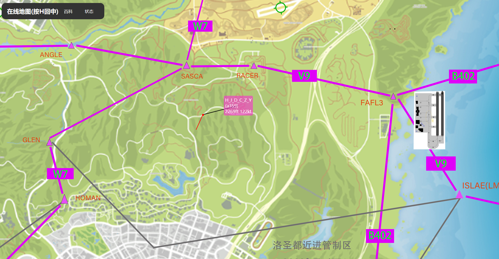

# fivem在线地图（fivem_web_map）
**[English version readme.md ]( readme_en.md)**   

web_map是一个基于openresty的fivem在线地图，可以在游戏外查看服务器的在线玩家和服务器的地图，服务器总体使用websocket和数据库实现，后端代码使用lua实现。
在线地图起初是为模拟飞行空中交通管制员使用的管制员地图，在编写的过程中，大多功能也围绕空中交通管制展开，未来，我们也会致力于将web_map完善为一个通用的工具，可以用于服务器的在线玩家查看，服务器地图查看等功能。  

[示例](https://webmap.hjdczy.top)
## 安装
我们测试使用的服务器为ubuntu22.04。
### 安装openresty
openresty是一个基于nginx的web服务器，它可以使用lua来编写后端代码，我们使用它来实现websocket和lua的后端代码。
对于linux系统，我们推荐您使用openresty的预编译包，您可以在[openresty](https://openresty.org/en/linux-packages.html)下载到最新的预编译包。我们的启动文件`openresty.sh`是基于预编译包的，如果您使用源码编译的openresty，您可能需要更改启动文件。

您可以使用`systemctl status openresty`来查看openresty是否安装成功。(可能需要sudo)
### 接入fivem
源码的某些文件是fivem所需要的，某些是前端浏览器所需要的，具体可以在fxmanifest.lua中查看。我们推荐您直接将全部文件放在~/server-data/resources/文件夹下。  

本插件的fivem端依赖mysql-async运行，您需要提前安装mysql-async。  

（在先前的版本中，并不依赖于mysql-async，而是使用客户端的websocket直接连接到服务器数据库，但是如果这样做，碍于某些玩家的网络稳定性，地图并不会显示全部玩家，所以这版代码被弃用，您可以在`./script.js`中找到这部分代码）  

您需要运行`mysql.sql`来创建所需的数据库。

在将文件放入服务器后，您需要在fivem的server.cfg中加入`start web_map`来启用fivem端。
### 更改配置文件

在`conf/nginx.conf`中，您需要更改您的lua和html文件的绝对路径、您的端口以及您的ssl证书路径。（`conf/nginx.conf`的
```
listen 2345 ssl;
ssl_certificate /hjdczy.top/cert/Nginx/hjdczy.top.pem;
ssl_certificate_key /hjdczy.top/cert/Nginx/hjdczy.top.key;
root /fivem_server/GTAV/server-data/resources/web_map/client;
content_by_lua_file /fivem_server/GTAV/server-data/resources/web_map/server/front.lua;
content_by_lua_file /fivem_server/GTAV/server-data/resources/web_map/server/server.lua;
```
这一部分）

您需要填充config.json.example.~~的内容并且将其更名为config.json，放在项目根目录下（与openresty.sh同级）。

您需要在`client/script.js`第一行更改您的服务器地址来使得websocket连接到您的服务器。

您可以将`client/index.html`中的
```     
<div>
    <a href="https://hjdczy.top:333/">百科</a>
    <a href="http://175.24.205.80:2333/status/serverinfo">状态</a>
</div>
```
更改为自己想要的链接。

您可以使用运行`openresty -p ` pwd`/ -c conf/nginx.conf`来启动服务器，或者直接运行我写好的openresty.sh ,运行`stop.sh`来停止服务器。

### 创建地图图床(可选)
我们自己编写了一个简易的地图引擎来实现地图的显示，您可以在`/client/script.js`的525(image.src = `https://hjdczy.top:3307/mydevice/webmap/${zoom}/${j}/${i}.png`;)和671行( image.src = `https://hjdczy.top:3307/mydevice/webmap/${this.zoom}/${col + j}/${row + i}.png`;)找到我们的图床地址，如果您想要更改为自己的图片源，您可以将其更改为您自己的源地址。我们的图床结构已经打包到了`./webmap.zip`中，您可以仿照我们的图床结构来创建自己的图床，其中0,1,2,3为缩放等级，每一张图片的像素数都是1500*1500。您需要自行切割图片。原图已经放到了`./map.png`和`./air_chart_ver3.png`中。

## 使用
注意：在线地图未对移动设备进行任何优化，请您使用有鼠标的设备打开网页使用。
在安装完成后，您可以在浏览器中输入`https://您的服务器地址:您的端口`来访问在线地图。

效果如下：


### 功能介绍
#### 在地图页面，您可以：
- 按住鼠标拖动地图
- 使用鼠标滚轮缩放
- 按H回中
- 鼠标快速双击，在按下第二次之后拖动，即可拖动出两点之间的轨迹线，轨迹线中点显示两端点之间的夹角以及距离（距离为游戏坐标距离，以米为单位）

#### 对于玩家游戏标牌，您可以：
- 当鼠标在玩家标牌上时，您可以按住鼠标拖动玩家标牌。（当不同玩家标牌重叠时，此功能会非常好用）
- 当玩家不在飞机上时，玩家标牌为黑色，否则为粉色，且显示信息
- 若玩家名称后有括号，此括号显示的是玩家目前驾驶的载具名
- 当玩家在飞机上时，玩家标牌为粉色，且显示下列信息（按照从上到下，从左到右的顺序排序）
    - 玩家名
    - 括号：玩家驾驶的载具名
    - 玩家海平面高度（单位ft）
    - 玩家速度（单位节）
    - 玩家速度预计线：当玩家有一定速度时，您会看到玩家位置点（红点，不是标牌）处有一线段引出，此为速度预计线。
  	    - 速度预计线的长度随玩家速度的变化而变化，玩家速度越大，速度预计线越长。
        - 速度预计线的方向与玩家当前机头朝向相同。
        - 速度预计线可以被管制员用于判断未分配垂直间隔的机组是否有相撞风险，若后一机组的速度预计线明显长于前一机组，则可以判定有相撞风险，需要采取操作。

#### 玩家与管制员交互
对于玩家：
- 玩家可以在游戏中输入指令`/ATC [... ...] `（其中`[... ...]`为文本内容，指令与文本内容间加空格）来向在线地图发送消息（一般是飞行计划），管制员可以将鼠标置于玩家标牌上并按空格键来查看此消息，鼠标左键点击其他区域关闭。其中，消息的第一条必须是呼号，因为javascript会截取第一项作为呼号显示在标牌上。，如：“/ATC CSC7854 LSIA LOCAL"。

- 玩家可以在游戏中输入`/ident`来模拟识别自己的应答机。当玩家识别自己的应答机后，在在线地图上，玩家的标牌会高亮5秒以提醒管制员。

- 玩家可以在游戏中输入`/squawk [四位八进制数]`来模拟设置自己的应答机编码。当玩家设置自己的应答机编码后，在在线地图上，玩家的标牌会显示应答机编码。其中，应答机7500,7600,7700会显示为特殊颜色。

### 2024.7.28更新
增加了触控设备的双指缩放和拖动功能，但是由于性能限制，在手指点击时玩家标签的加载会暂停，并且我们将在线地图的帧率限制在了30帧

### 2024.10.5更新
增加了应答机功能，更新了标牌功能，当有呼号时，仅显示呼号，呼号和名字只显示一个。

## 还未解决的BUG和开发展望
1. 优化触控设备，目前支持双指缩放和拖动
2. 有时玩家退出游戏时，数据库中的玩家记录并不能被成功删除，目前只能通过刷新数据库记录来删除


我们正在努力解决这些问题，如果您有解决方案，欢迎您提交pull request。
